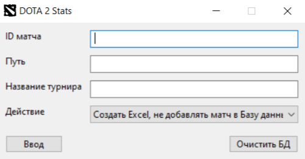
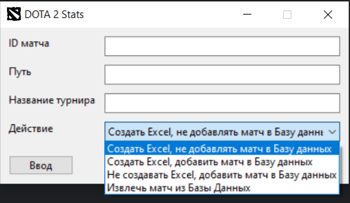
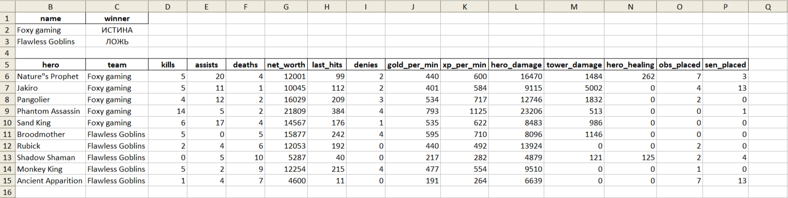
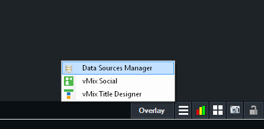
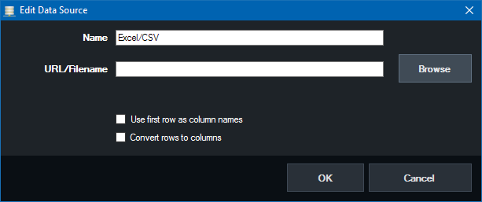
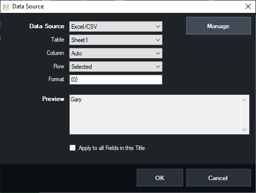
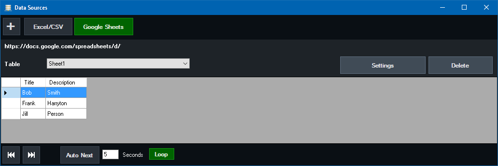

# Dota 2 Vmix bridge

## Описание проекта (Description)

Программа для автоматизации вывода итоговой статистики матчей Dota 2 в прямой эфир приложения Vmix.
VMix - профессиональный софт для ведения прямых трансляций. Поддерживает функцию DataSource,
которая позволяет загружать и отображать данные из внешних файлов, включая excel-файлы.
Это позволяет автоматически обновлять информацию на экране, при этом не отвлекая режиссера, титровальщика или дизайнера на введение статистики вручную.

A program for automating the output of the final statistics of Dota 2 matches in the live Vmix application.
vMix is a professional software for live broadcasts. It supports the DataSource function,
which allows you to download and display data from external files, including excel files.
This allows you to update information on the screen automatically, without distracting the director, the titer or the designer to enter statistics manually.

## Реализованные требования (Implemented Requirements)

- Получает статистику матча по id игры;
- Может сохранить ститистику матча в Базу Данных;
- Выводит статистику игры в виде excel-файла, который затем привязывается к VMix DataSourse;
- Способен перезаписывать файл, сохраняя формулы, записанные на других страницах для связывания с VMix.

<!--Space-->

- Gets match statistics by game id;
- Can save match statistics to the Database;
- Outputs game statistics as an excel file, which is then linked to a vMix Datasource;
- Able to overwrite a file, saving formulas written on other pages for linking to vMix.

## Подготовка проекта (Project preparation)

1. **Предварительная установка**
   * Установите VMix: https://www.vmix.com/software/download.aspx
   * Установите PostgreSQL: https://www.postgresql.org/


2. **Создайте Базу Данных в PostgreSQL**
   * В дальнейшем, по умолчанию, в проекте используется База Данных с названием 'Tournament'
   * Cоздайте в папке проекта файл с названием '.env' и пропишите в нем настройки для подключения к Базу Данных:
      ```
      HOST="your_host"
      PORT=5432
      USER="postgres"
      PASSWORD="password"
      ```


3. **Предварительная сборка**
   * Установите необходимые Python-пакеты, выполнив следующую команду в консоли

   ```bash
   pip install -r requirements.txt
   ```
   
   * Преобразуйте проект в исполняемый ```.exe``` файл:
   
     ```pyinstaller gui.spec```

   * Внутри проекта будет создана папка 'dict' в которой будет лежать ```Dota2Stats.exe```


4. **Запуск проекта**
   * Поместите исполняемый файл ```Dota2Stats.exe``` на компьютер, с которого будет транслироваться графика
   (Например, на компьютер титровальщика, соедененный с компьютером режиссера через NDI)

   * Запустите исполняемый файл 
   
   
   * В поле 'ID' - введите ID игры
   * В поле 'Путь' - укажите путь для сохранения файла (по умолчанию папка, где лежит исполняемый файл)
   * В поле 'Название турнира' - название Базы Данных, созданной в Postgres (по умолчанию используется название 'Tournament')
   * Выберите действие, которое хотите сделать
   
   
   * Для выполнения программы нажмите 'Ввод'
   * Если надо очистить Базу Данных, нажмите 'Очистить БД'
   * Пример содержимого excel-файла
   
   


5. **Настройка DataSource в VMix**
   * Выберите 'Data Sources Manager' в нижней панели   
   
   * Выберите 'Excel/CSV' в качестве источника 
   
   * Выберите лист, информацию из которого нужно привязать к графике
   
   * Свяжите ячейки из excel-файла с ячейками в вашей графике
   
   * Если ваша графика нуждается в более сложной логике, в excel-файле на любой странице, кроме 'Dota 2' можно дополнительно прописать
     excel-формулы, при обновлении статистики, будет переписана лишь страница 'Dota 2' со статистикой из игры, ваши формулы останутся нетронутыми
   * Подробная документация по настройке DataSourse в VMix: https://www.vmix.com/help27/DataSources.html


<!--Space-->


1. Preliminary Setup
   *   Install VMix: [https://www.vmix.com/software/download.aspx](https://www.vmix.com/software/download.aspx)
   *   Install PostgreSQL: [https://www.postgresql.org/](https://www.postgresql.org/)


2. Create a Database in PostgreSQL
   *   By default, the project uses a database named `'Tournament'`.
   * Create a file named .env in the project directory and write the database connection settings in it:
      ```
      HOST="your_host"
      PORT=5432
      USER="postgres"
      PASSWORD="password"
      ```

3. Preliminary Build
   *   Install the necessary Python packages by running the following command in the console:

       ```bash
       pip install -r requirements.txt
       ```

   *   Convert the project into an executable `.exe` file:

       ```bash
       pyinstaller gui.spec
       ```

   *   A `'dist'` folder will be created within the project, containing the `Dota2Stats.exe` executable.


4. Running the Project
   *   Place the executable `Dota2Stats.exe` file on the computer from which the graphics will be broadcast (for example, on the titler computer connected to the director's computer via NDI).
   *   Run the executable file.
   
   

   *   In the `'ID'` field, enter the game ID.
   *   In the `'Path'` field, specify the path to save the file (the default is the folder where the executable file is located).
   *   In the `'Tournament Name'` field, enter the name of the database created in Postgres (the default is `'Tournament'`).

   *   Select the action you want to perform.
   
   

   *   To execute the program, press `'Enter'`.
   *   If you need to clear the database, press `'Clear DB'`.
   * Example of an Excel file's content:
   


5. Configuring DataSource in VMix

   *   Select `'Data Sources Manager'` in the bottom panel.
       

   *   Select `'Excel/CSV'` as the source.
       

   *   Select the sheet from which you want to link information to the graphics.
       

   *   Link the cells from the Excel file to the cells in your graphics.
       

   *   If your graphics require more complex logic, you can additionally write Excel formulas on any page except `'Dota 2'`. When the statistics are updated, only the `'Dota 2'` page with statistics from the game will be overwritten; your formulas will remain untouched.

   *   Detailed documentation on setting up DataSource in VMix: [https://www.vmix.com/help27/DataSources.html](https://www.vmix.com/help27/DataSources.html)

## Использованные технологии (Technology Stack)

- **Python 3.13**
- **PostgreSQL**